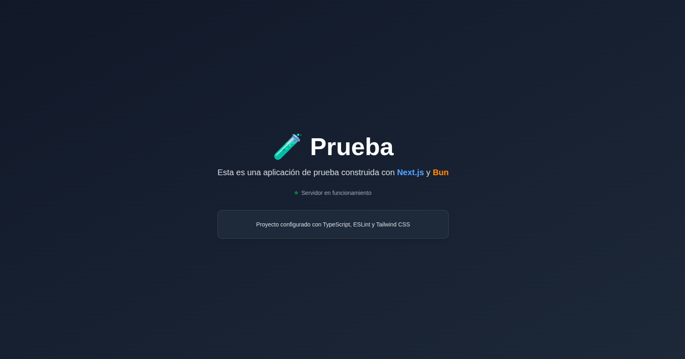

# Prueba

Esta es una aplicación de prueba construida con Next.js y Bun, que demuestra la implementación de tecnologías modernas de desarrollo web.



## Características

- ⚡ Construido con Next.js
- 🔥 TypeScript para tipado seguro
- 🎨 Tailwind CSS para estilos
- 🚀 ESLint para linting
- ⚡ Bun como runtime y package manager

## Inicio Rápido

1. Clona el repositorio
2. Instala las dependencias:

```bash
bun install
```

3. Inicia el servidor de desarrollo:

```bash
bun dev
```

Abre [http://localhost:3000](http://localhost:3000) en tu navegador para ver el resultado.

## Estado del Proyecto

- ✅ Servidor en funcionamiento
- ✅ Configuración básica completada
- ✅ Proyecto configurado con TypeScript, ESLint y Tailwind CSS

## Estructura del Proyecto

```
mi-app-next/
├── app/
│   └── page.tsx
├── public/
│   └── demo.png
├── components/
└── ...
```

## Tecnologías Utilizadas

- [Next.js](https://nextjs.org)
- [Bun](https://bun.sh)
- [TypeScript](https://www.typescriptlang.org/)
- [Tailwind CSS](https://tailwindcss.com/)

## Notas de Desarrollo

Este proyecto está configurado con las mejores prácticas de desarrollo moderno, incluyendo:
- TypeScript para un desarrollo más seguro
- ESLint para mantener la calidad del código
- Tailwind CSS para un diseño responsive y moderno

## Licencia

MIT
